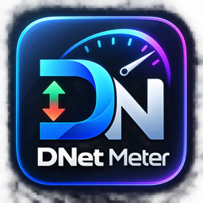
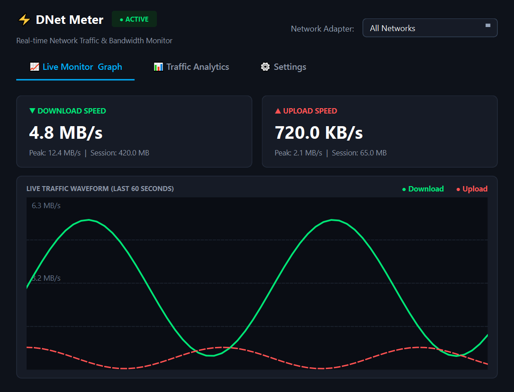
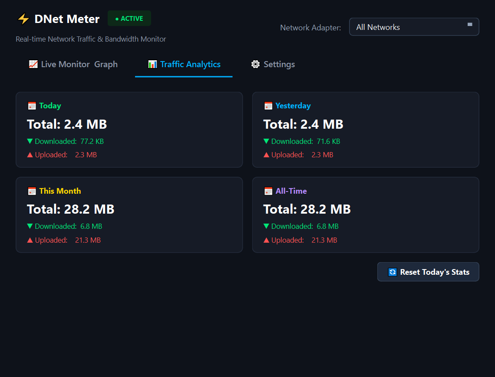
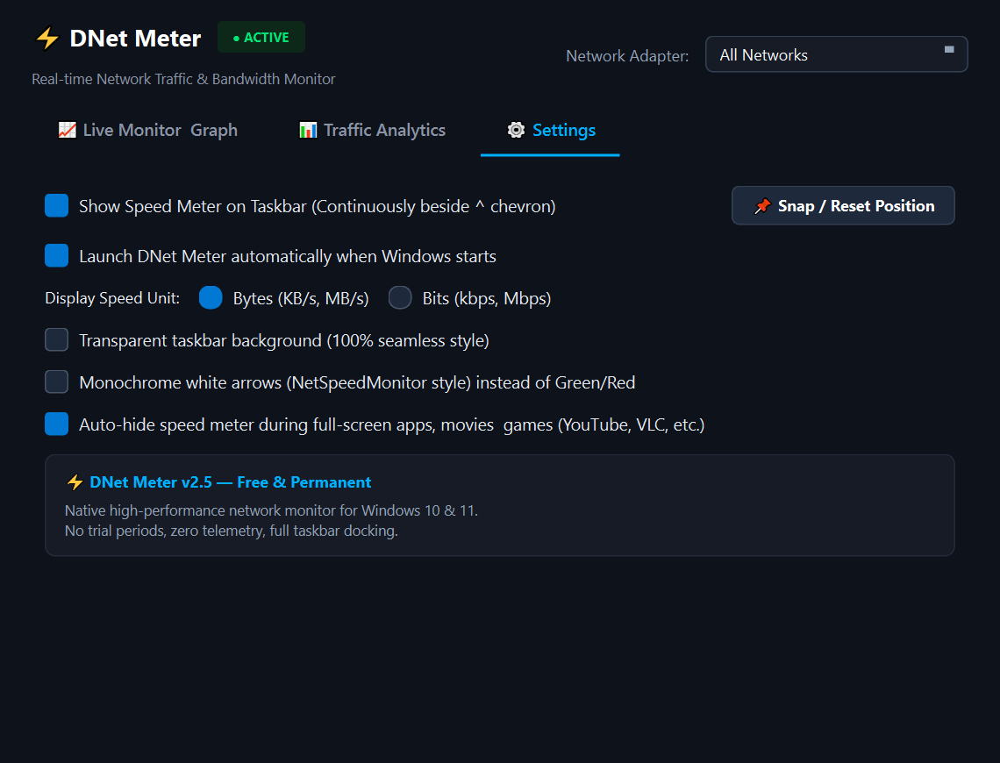

  

<h1 align="center">⚡ DNet Meter for Windows</h1>

  <b>A modern, high-precision, real-time Internet speed monitor & bandwidth tracker docked seamlessly on your Windows taskbar.</b> 
  <i>Permanent, lightweight freeware designed as the premier alternative to DU Meter & NetSpeedMonitor.</i>

  
  
  
  

---

## 📥 Download DNet Meter

Get the latest pre-compiled binaries directly from the **[GitHub Releases Tab](../../releases/latest)**:

| Edition | Description | Download Link |
| :--- | :--- | :--- |
| **🚀 Windows Setup Wizard** | Full installer with Start Menu shortcuts & uninstaller | [**Download DNet_Meter_Setup.exe**](../../releases/latest) |
| **💼 Standalone Portable** | Single `.exe` requiring zero installation. Run from anywhere! | [**Download DNetMeter.exe**](../../releases/latest) |

> [!TIP]
> **No dependencies or Python required!** Both editions are self-contained Windows native executables that run out-of-the-box on Windows 10 and Windows 11.

---

## 🖼️ Application Showcase

  <b>Live Bandwidth Monitor & 60-Second Real-Time Dual Waveform</b> 
  

 

  <b>Comprehensive Data Traffic Analytics & Daily/Monthly Quota Tracking</b> 
  

 

  <b>Full Customization, Glassmorphic Themes & Smart Fullscreen Auto-Hide</b> 
  

 

  <b>Minimalist, Non-Intrusive Taskbar Widget (Sits Beside System Tray)</b> 
  

---

## ✨ Core Features

### 📌 1. Native Windows Taskbar Integration
- **Docked Perfectly**: Sits right on your Windows taskbar next to the notification area (`^`) chevron icon.
- **Unlockable & Draggable**: Easily drag the widget anywhere across multi-monitor setups.
- **Auto-Coordinate Memory**: Remembers its exact screen coordinates across reboots.

### 🎬 2. Smart Fullscreen Auto-Hide
- **Zero Distraction While Watching**: Automatically detects when YouTube, VLC, Netflix, or video games enter full-screen mode and gracefully hides the widget.
- **Instant Restore**: Reappears automatically as soon as you exit full-screen mode.

### 🎨 3. 100% Seamless Transparency & Themes
- **Seamless Style**: 100% transparent background with zero dark boxes or borders for a native Windows aesthetic.
- **Glassmorphic Themes**: Choose from Dark Glass, Midnight Blue, AMOLED Black, or Cyberpunk Neon.
- **Custom Font Color & Sparkline**: Color-coded live download (`▼`) and upload (`▲`) speed indicators with live mini-histograms.

### ⚡ 4. High-Precision Bandwidth Tracking
- **Sub-Second Accuracy**: Real-time traffic accounting refreshed dynamically every 1 second.
- **Flexible Units**: Toggle instantly between **Bytes/sec** (`KB/s`, `MB/s`) and **Bits/sec** (`Kbps`, `Mbps`).
- **Adapter Targeting**: Monitor all network cards combined, or isolate specific **Wi-Fi** / **Ethernet** connections.

### 📊 5. Persistent Traffic Quotas & Analytics
- **Historical Accounting**: Tracks **Today's**, **Yesterday's**, **This Month's**, and **All-Time** data usage.
- **Survives Shutdowns**: Usage statistics are preserved across system reboots.
- **One-Click Reset**: Safely reset counters anytime from the dashboard.

### 🚀 6. Windows Startup Integration
- **Boot with Windows**: One-click autostart option integrated via the standard Windows registry (`HKCU\Software\Microsoft\Windows\CurrentVersion\Run`).
- **Ultra-Lightweight**: Uses Win32 Native APIs consuming less than **0.1% CPU** and negligible memory.

---

## 🕹️ Controls & Shortcuts

| Action | Result |
| :--- | :--- |
| **Left Click + Drag** | Drag widget anywhere on the taskbar or desktop |
| **Double Click (Widget)** | Open the **Dashboard & Live Analytics** window |
| **Right Click (Widget)** | Open quick context menu (Themes, Snap to Taskbar, Lock Position, Settings, Exit) |
| **System Tray Icon** | View live upload/download in hover tooltip, toggle widget visibility, or open menu |

---

## 💻 System Requirements

- **Operating System**: Windows 11 / Windows 10 (64-bit)
- **Processor**: Any modern x64 processor (Intel / AMD)
- **RAM**: ~30 MB free RAM
- **Disk Space**: ~80 MB for complete installation

---

## 🛡️ Privacy & Security

- **100% Offline & Private**: DNet Meter runs entirely on your local machine.
- **Zero Telemetry**: No analytics, tracking, or outbound internet connections of any kind.
- **Non-Destructive**: Never hooks or intercepts network packets; uses standard Windows performance counters.

---

  Developed with ❤️ for power users who want a clean, fast, and permanent internet speed meter.

